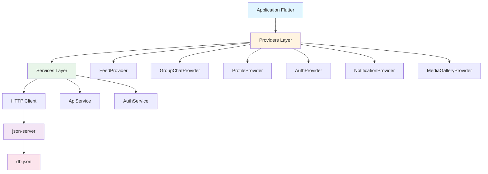
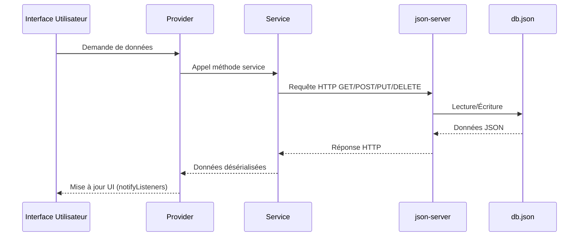

# Document de Conception : json-database-integration

## Vue d'ensemble

Cette fonctionnalité vise à remplacer toutes les données fictives (mock data) hardcodées dans l'application Flutter TableRonde par des appels API vers une base de données JSON (db.json) via json-server. L'objectif est de créer un environnement de développement et de test plus réaliste qui simule une véritable API REST.

L'application utilise actuellement 7 fichiers de données mock dans `lib/data/` qui seront progressivement remplacés par des appels API via les services existants (`ApiService`, `AuthService`) et les providers (`FeedProvider`, `GroupChatProvider`, `ProfileProvider`, etc.).

Cette migration permettra de :
- Tester l'application avec des données persistantes et modifiables
- Simuler un environnement backend réaliste
- Faciliter le développement de nouvelles fonctionnalités
- Préparer l'intégration avec une vraie API backend

## Architecture



## Flux de données principal




## Composants et Interfaces

### Composant 1: ApiService (Étendu)

**Objectif**: Service centralisé pour toutes les requêtes HTTP vers json-server

**Interface**:
```dart
class ApiService {
  static const String baseUrl = 'http://localhost:3000';
  
  // Posts
  static Future<List<PostModel>> getPosts();
  static Future<PostModel> getPost(String id);
  static Future<PostModel> createPost(PostModel post);
  static Future<PostModel> updatePost(String id, PostModel post);
  static Future<void> deletePost(String id);
  
  // Groupes
  static Future<List<GroupChatModel>> getGroups();
  static Future<GroupChatModel> getGroup(String id);
  static Future<GroupChatModel> createGroup(GroupChatModel group);
  static Future<GroupChatModel> updateGroup(String id, GroupChatModel group);
  static Future<void> deleteGroup(String id);
  
  // Messages
  static Future<List<MessageModel>> getMessages(String chatId);
  static Future<MessageModel> sendMessage(MessageModel message);
  static Future<void> deleteMessage(String id);
  
  // Profils
  static Future<List<UserProfileModel>> getProfiles();
  static Future<UserProfileModel> getProfile(String id);
  static Future<UserProfileModel> updateProfile(String id, UserProfileModel profile);
  
  // Notifications
  static Future<List<NotificationModel>> getNotifications(String userId);
  static Future<NotificationModel> createNotification(NotificationModel notification);
  static Future<void> markNotificationAsRead(String id);
  static Future<void> deleteNotification(String id);
  
  // Médias
  static Future<List<MediaItem>> getMediaByChat(String chatId);
  static Future<MediaItem> uploadMedia(MediaItem media);
  
  // Réactions
  static Future<List<ReactionModel>> getReactions(String postId);
  static Future<ReactionModel> addReaction(ReactionModel reaction);
  static Future<void> removeReaction(String id);
}
```

**Responsabilités**:
- Gérer toutes les requêtes HTTP (GET, POST, PUT, DELETE, PATCH)
- Sérialiser/désérialiser les données JSON
- Gérer les erreurs de connexion et les timeouts
- Fournir des méthodes typées pour chaque ressource

### Composant 2: FeedProvider (Modifié)

**Objectif**: Gérer l'état du feed social avec données API

**Interface**:
```dart
class FeedProvider extends ChangeNotifier {
  List<PostModel> _posts = [];
  bool _isLoading = false;
  String? _error;
  
  List<PostModel> get posts => _posts;
  bool get isLoading => _isLoading;
  String? get error => _error;
  
  Future<void> loadPosts();
  Future<void> createPost(PostModel post);
  Future<void> updatePost(String id, PostModel post);
  Future<void> deletePost(String id);
  Future<void> refreshPosts();
}
```

**Responsabilités**:
- Charger les posts depuis l'API
- Gérer le cache local des posts
- Notifier les widgets des changements
- Gérer les états de chargement et d'erreur


### Composant 3: GroupChatProvider (Modifié)

**Objectif**: Gérer l'état des groupes et messages avec données API

**Interface**:
```dart
class GroupChatProvider extends ChangeNotifier {
  List<GroupChatModel> _groups = [];
  Map<String, List<MessageModel>> _messagesByGroup = {};
  bool _isLoading = false;
  String? _error;
  
  List<GroupChatModel> get groups => _groups;
  bool get isLoading => _isLoading;
  String? get error => _error;
  
  List<MessageModel> getMessagesForGroup(String groupId);
  Future<void> loadGroups();
  Future<void> loadMessages(String groupId);
  Future<void> sendMessage(String groupId, MessageModel message);
  Future<void> createGroup(GroupChatModel group);
  Future<void> updateGroup(String id, GroupChatModel group);
}
```

**Responsabilités**:
- Charger les groupes depuis l'API
- Charger les messages par groupe
- Envoyer de nouveaux messages
- Gérer le cache des messages

### Composant 4: ProfileProvider (Modifié)

**Objectif**: Gérer l'état des profils utilisateurs avec données API

**Interface**:
```dart
class ProfileProvider extends ChangeNotifier {
  Map<String, UserProfileModel> _profiles = {};
  bool _isLoading = false;
  String? _error;
  
  UserProfileModel? getProfile(String userId);
  bool get isLoading => _isLoading;
  String? get error => _error;
  
  Future<void> loadProfiles();
  Future<void> loadProfile(String userId);
  Future<void> updateProfile(String userId, UserProfileModel profile);
  Future<void> refreshProfile(String userId);
}
```

**Responsabilités**:
- Charger les profils depuis l'API
- Mettre à jour les profils
- Gérer le cache des profils
- Notifier les changements de profil

### Composant 5: NotificationProvider (Nouveau)

**Objectif**: Gérer les notifications utilisateur avec données API

**Interface**:
```dart
class NotificationProvider extends ChangeNotifier {
  List<NotificationModel> _notifications = [];
  int _unreadCount = 0;
  bool _isLoading = false;
  String? _error;
  
  List<NotificationModel> get notifications => _notifications;
  int get unreadCount => _unreadCount;
  bool get isLoading => _isLoading;
  String? get error => _error;
  
  Future<void> loadNotifications(String userId);
  Future<void> markAsRead(String notificationId);
  Future<void> deleteNotification(String notificationId);
  Future<void> clearAllNotifications();
}
```

**Responsabilités**:
- Charger les notifications depuis l'API
- Marquer les notifications comme lues
- Supprimer les notifications
- Compter les notifications non lues


### Composant 6: MediaGalleryProvider (Modifié)

**Objectif**: Gérer les médias partagés avec données API

**Interface**:
```dart
class MediaGalleryProvider extends ChangeNotifier {
  Map<String, List<MediaItem>> _mediaByChat = {};
  bool _isLoading = false;
  String? _error;
  
  List<MediaItem> getMediaForChat(String chatId);
  bool get isLoading => _isLoading;
  String? get error => _error;
  
  Future<void> loadMediaForChat(String chatId);
  Future<void> uploadMedia(String chatId, MediaItem media);
  Future<void> deleteMedia(String mediaId);
}
```

**Responsabilités**:
- Charger les médias par conversation
- Uploader de nouveaux médias
- Supprimer des médias
- Filtrer les médias par type

## Modèles de Données

### PostModel

```dart
class PostModel {
  final String id;
  final String authorId;
  final String authorName;
  final String authorUsername;
  final String? authorAvatar;
  final bool isAuthorVerified;
  final String content;
  final List<String>? imageUrls;
  final String? videoUrl;
  final String? gifUrl;
  final DateTime timestamp;
  final PostType type;
  final int reactionCount;
  final int commentCount;
  final int shareCount;
  final int viewCount;
  final List<String> hashtags;
  final List<String> mentions;
  final String? location;
  final bool isPinned;
  final bool commentsEnabled;
  final String? originalPostId;
  
  PostModel({...});
  
  factory PostModel.fromJson(Map<String, dynamic> json);
  Map<String, dynamic> toJson();
}
```

**Règles de validation**:
- `id` doit être unique et non vide
- `authorId` doit correspondre à un utilisateur existant
- `content` ne peut pas être vide pour les posts de type text
- `timestamp` doit être une date valide
- Les compteurs (reactions, comments, etc.) doivent être >= 0

### GroupChatModel

```dart
class GroupChatModel {
  final String id;
  final String name;
  final String? description;
  final String? photoUrl;
  final List<GroupMemberModel> members;
  final DateTime createdAt;
  final String? lastMessage;
  final DateTime? lastMessageTime;
  final int unreadCount;
  
  GroupChatModel({...});
  
  factory GroupChatModel.fromJson(Map<String, dynamic> json);
  Map<String, dynamic> toJson();
}
```

**Règles de validation**:
- `id` doit être unique
- `name` ne peut pas être vide
- `members` doit contenir au moins 2 membres
- Au moins un membre doit avoir le rôle `admin`


### UserProfileModel

```dart
class UserProfileModel {
  final String id;
  final String name;
  final String username;
  final String? bio;
  final String? phone;
  final String? avatarUrl;
  final DateTime createdAt;
  final bool isOnline;
  final String? currentActivity;
  final List<UserActivity> recentActivities;
  final List<UserPost> posts;
  
  UserProfileModel({...});
  
  factory UserProfileModel.fromJson(Map<String, dynamic> json);
  Map<String, dynamic> toJson();
}
```

**Règles de validation**:
- `id` doit être unique
- `name` ne peut pas être vide
- `username` doit commencer par '@' et être unique
- `phone` doit être au format valide si fourni

### NotificationModel

```dart
class NotificationModel {
  final String id;
  final String userId;
  final String type;
  final String title;
  final String message;
  final DateTime timestamp;
  final bool isRead;
  final Map<String, dynamic>? data;
  
  NotificationModel({...});
  
  factory NotificationModel.fromJson(Map<String, dynamic> json);
  Map<String, dynamic> toJson();
}
```

**Règles de validation**:
- `id` doit être unique
- `userId` doit correspondre à un utilisateur existant
- `type` doit être l'un des types valides (message, like, comment, follow, etc.)
- `timestamp` doit être une date valide

### MediaItem

```dart
class MediaItem {
  final String id;
  final MediaType type;
  final String url;
  final String? thumbnailUrl;
  final String? fileName;
  final int? fileSize;
  final int? duration;
  final DateTime timestamp;
  final String senderId;
  final String senderName;
  
  MediaItem({...});
  
  factory MediaItem.fromJson(Map<String, dynamic> json);
  Map<String, dynamic> toJson();
}
```

**Règles de validation**:
- `id` doit être unique
- `type` doit être l'un des types valides (photo, video, document, voice, link)
- `url` ne peut pas être vide
- `duration` requis pour video et voice
- `fileName` requis pour document


## Algorithmes Principaux

### Algorithme 1: Chargement des Posts avec Gestion d'Erreur

```dart
ALGORITHM loadPosts
INPUT: aucun
OUTPUT: List<PostModel> ou Exception

PRECONDITIONS:
  - ApiService est initialisé
  - json-server est en cours d'exécution
  - Connexion réseau disponible

POSTCONDITIONS:
  - _posts contient les données chargées
  - _isLoading est false
  - _error contient le message d'erreur si échec
  - notifyListeners() a été appelé

BEGIN
  SET _isLoading = true
  SET _error = null
  CALL notifyListeners()
  
  TRY
    // Appel API pour récupérer les posts
    posts ← AWAIT ApiService.getPosts()
    
    // Validation des données
    FOR EACH post IN posts DO
      ASSERT post.id IS NOT EMPTY
      ASSERT post.authorId IS NOT EMPTY
      ASSERT post.content IS NOT EMPTY OR post.imageUrls IS NOT EMPTY
    END FOR
    
    // Tri par date décroissante
    posts ← SORT posts BY timestamp DESC
    
    // Mise à jour de l'état
    SET _posts = posts
    SET _isLoading = false
    CALL notifyListeners()
    
    RETURN posts
    
  CATCH error
    SET _isLoading = false
    SET _error = error.message
    CALL notifyListeners()
    
    THROW Exception("Erreur de chargement des posts: " + error.message)
  END TRY
END

LOOP INVARIANTS:
  - _isLoading reflète toujours l'état actuel de chargement
  - _error est null pendant le chargement réussi
  - notifyListeners() est appelé après chaque changement d'état
```

### Algorithme 2: Envoi de Message avec Optimistic Update

```dart
ALGORITHM sendMessage
INPUT: groupId (String), message (MessageModel)
OUTPUT: MessageModel ou Exception

PRECONDITIONS:
  - groupId existe dans _groups
  - message.text IS NOT EMPTY
  - message.senderId correspond à l'utilisateur connecté
  - Connexion réseau disponible

POSTCONDITIONS:
  - Message ajouté à _messagesByGroup[groupId]
  - Groupe mis à jour avec lastMessage et lastMessageTime
  - notifyListeners() appelé
  - Message persisté dans db.json

BEGIN
  // Validation des entrées
  ASSERT groupId IS NOT EMPTY
  ASSERT message.text IS NOT EMPTY
  ASSERT message.senderId IS NOT EMPTY
  
  // Optimistic update: ajouter le message localement d'abord
  tempMessage ← CREATE MessageModel WITH
    id = "temp_" + timestamp
    text = message.text
    senderId = message.senderId
    timestamp = NOW()
    isSentByMe = true
    isRead = false
  END CREATE
  
  // Ajouter au cache local
  IF _messagesByGroup[groupId] IS NULL THEN
    _messagesByGroup[groupId] ← EMPTY LIST
  END IF
  
  _messagesByGroup[groupId].ADD(tempMessage)
  CALL notifyListeners()
  
  TRY
    // Envoi au serveur
    sentMessage ← AWAIT ApiService.sendMessage(message)
    
    // Remplacer le message temporaire par le message réel
    index ← FIND INDEX OF tempMessage IN _messagesByGroup[groupId]
    _messagesByGroup[groupId][index] ← sentMessage
    
    // Mettre à jour le groupe
    group ← FIND group WHERE group.id = groupId
    group.lastMessage ← sentMessage.text
    group.lastMessageTime ← sentMessage.timestamp
    
    CALL notifyListeners()
    
    RETURN sentMessage
    
  CATCH error
    // Rollback: supprimer le message temporaire
    _messagesByGroup[groupId].REMOVE(tempMessage)
    CALL notifyListeners()
    
    THROW Exception("Erreur d'envoi du message: " + error.message)
  END TRY
END

LOOP INVARIANTS:
  - _messagesByGroup[groupId] contient toujours les messages triés par timestamp
  - Chaque message a un id unique
  - L'UI est mise à jour immédiatement (optimistic update)
```


### Algorithme 3: Synchronisation des Profils avec Cache

```dart
ALGORITHM loadProfile
INPUT: userId (String)
OUTPUT: UserProfileModel ou Exception

PRECONDITIONS:
  - userId IS NOT EMPTY
  - ApiService est initialisé
  - Connexion réseau disponible

POSTCONDITIONS:
  - Profil chargé et mis en cache dans _profiles[userId]
  - notifyListeners() appelé
  - Profil retourné

BEGIN
  ASSERT userId IS NOT EMPTY
  
  // Vérifier le cache d'abord
  IF _profiles[userId] IS NOT NULL THEN
    cachedProfile ← _profiles[userId]
    cacheAge ← NOW() - cachedProfile.lastUpdated
    
    // Si le cache a moins de 5 minutes, le retourner
    IF cacheAge < 5 MINUTES THEN
      RETURN cachedProfile
    END IF
  END IF
  
  // Cache expiré ou inexistant, charger depuis l'API
  SET _isLoading = true
  CALL notifyListeners()
  
  TRY
    profile ← AWAIT ApiService.getProfile(userId)
    
    // Validation du profil
    ASSERT profile.id = userId
    ASSERT profile.name IS NOT EMPTY
    ASSERT profile.username STARTS WITH '@'
    
    // Mettre à jour le cache
    profile.lastUpdated ← NOW()
    _profiles[userId] ← profile
    
    SET _isLoading = false
    CALL notifyListeners()
    
    RETURN profile
    
  CATCH error
    SET _isLoading = false
    SET _error = error.message
    CALL notifyListeners()
    
    // Si on a un cache, le retourner même s'il est expiré
    IF _profiles[userId] IS NOT NULL THEN
      RETURN _profiles[userId]
    END IF
    
    THROW Exception("Erreur de chargement du profil: " + error.message)
  END TRY
END

LOOP INVARIANTS:
  - Le cache contient toujours des profils valides
  - lastUpdated est mis à jour à chaque chargement réussi
  - Les profils en cache ont moins de 5 minutes ou sont marqués comme expirés
```

### Algorithme 4: Gestion des Notifications en Temps Réel

```dart
ALGORITHM loadNotifications
INPUT: userId (String)
OUTPUT: List<NotificationModel> ou Exception

PRECONDITIONS:
  - userId IS NOT EMPTY
  - Utilisateur est authentifié
  - ApiService est initialisé

POSTCONDITIONS:
  - _notifications contient les notifications chargées
  - _unreadCount est mis à jour
  - notifyListeners() appelé

BEGIN
  ASSERT userId IS NOT EMPTY
  
  SET _isLoading = true
  CALL notifyListeners()
  
  TRY
    // Charger les notifications depuis l'API
    notifications ← AWAIT ApiService.getNotifications(userId)
    
    // Trier par date décroissante
    notifications ← SORT notifications BY timestamp DESC
    
    // Calculer le nombre de notifications non lues
    unreadCount ← 0
    FOR EACH notification IN notifications DO
      IF notification.isRead = false THEN
        unreadCount ← unreadCount + 1
      END IF
    END FOR
    
    // Mettre à jour l'état
    _notifications ← notifications
    _unreadCount ← unreadCount
    SET _isLoading = false
    CALL notifyListeners()
    
    RETURN notifications
    
  CATCH error
    SET _isLoading = false
    SET _error = error.message
    CALL notifyListeners()
    
    THROW Exception("Erreur de chargement des notifications: " + error.message)
  END TRY
END

LOOP INVARIANTS:
  - _unreadCount correspond toujours au nombre de notifications avec isRead = false
  - _notifications est toujours trié par timestamp décroissant
  - Chaque notification a un id unique
```


## Fonctions Clés avec Spécifications Formelles

### Fonction 1: ApiService.getPosts()

```dart
static Future<List<PostModel>> getPosts() async {
  final response = await http.get(Uri.parse('$baseUrl/posts'));
  
  if (response.statusCode == 200) {
    final List<dynamic> data = json.decode(response.body);
    return data.map((json) => PostModel.fromJson(json)).toList();
  } else {
    throw Exception('Erreur lors du chargement des posts');
  }
}
```

**Préconditions:**
- `baseUrl` est configuré et accessible
- json-server est en cours d'exécution sur le port 3000
- La collection `posts` existe dans db.json
- Connexion réseau disponible

**Postconditions:**
- Retourne une liste de `PostModel` valides
- Si succès: `response.statusCode == 200`
- Si échec: lance une `Exception` avec message descriptif
- Aucun effet de bord sur l'état de l'application

**Invariants de boucle:** N/A (pas de boucle explicite)

### Fonction 2: FeedProvider.createPost()

```dart
Future<void> createPost(PostModel post) async {
  _isLoading = true;
  notifyListeners();
  
  try {
    final createdPost = await ApiService.createPost(post);
    _posts.insert(0, createdPost);
    _isLoading = false;
    notifyListeners();
  } catch (e) {
    _isLoading = false;
    _error = e.toString();
    notifyListeners();
    rethrow;
  }
}
```

**Préconditions:**
- `post` est un objet `PostModel` valide
- `post.content` n'est pas vide OU `post.imageUrls` n'est pas vide
- `post.authorId` correspond à l'utilisateur connecté
- ApiService est initialisé

**Postconditions:**
- Si succès: post ajouté en tête de `_posts`
- Si succès: `_isLoading == false` et `_error == null`
- Si échec: `_isLoading == false` et `_error` contient le message
- `notifyListeners()` appelé dans tous les cas
- Exception relancée en cas d'échec

**Invariants de boucle:** N/A

### Fonction 3: GroupChatProvider.loadMessages()

```dart
Future<void> loadMessages(String groupId) async {
  _isLoading = true;
  notifyListeners();
  
  try {
    final messages = await ApiService.getMessages(groupId);
    _messagesByGroup[groupId] = messages;
    _isLoading = false;
    notifyListeners();
  } catch (e) {
    _isLoading = false;
    _error = e.toString();
    notifyListeners();
    rethrow;
  }
}
```

**Préconditions:**
- `groupId` n'est pas vide
- `groupId` correspond à un groupe existant
- ApiService est initialisé
- Connexion réseau disponible

**Postconditions:**
- Si succès: `_messagesByGroup[groupId]` contient les messages chargés
- Messages triés par timestamp croissant
- `_isLoading == false` après exécution
- `notifyListeners()` appelé
- Exception relancée en cas d'échec

**Invariants de boucle:** N/A


### Fonction 4: ProfileProvider.updateProfile()

```dart
Future<void> updateProfile(String userId, UserProfileModel profile) async {
  _isLoading = true;
  notifyListeners();
  
  try {
    final updatedProfile = await ApiService.updateProfile(userId, profile);
    _profiles[userId] = updatedProfile;
    _isLoading = false;
    notifyListeners();
  } catch (e) {
    _isLoading = false;
    _error = e.toString();
    notifyListeners();
    rethrow;
  }
}
```

**Préconditions:**
- `userId` n'est pas vide
- `profile` est un objet `UserProfileModel` valide
- `profile.name` n'est pas vide
- `profile.username` commence par '@'
- Utilisateur a les permissions pour modifier ce profil

**Postconditions:**
- Si succès: `_profiles[userId]` contient le profil mis à jour
- Si succès: `_isLoading == false` et `_error == null`
- Si échec: `_isLoading == false` et `_error` contient le message
- `notifyListeners()` appelé dans tous les cas
- Profil persisté dans db.json

**Invariants de boucle:** N/A

### Fonction 5: NotificationProvider.markAsRead()

```dart
Future<void> markAsRead(String notificationId) async {
  try {
    await ApiService.markNotificationAsRead(notificationId);
    
    final index = _notifications.indexWhere((n) => n.id == notificationId);
    if (index != -1) {
      _notifications[index] = _notifications[index].copyWith(isRead: true);
      _unreadCount = max(0, _unreadCount - 1);
      notifyListeners();
    }
  } catch (e) {
    _error = e.toString();
    notifyListeners();
    rethrow;
  }
}
```

**Préconditions:**
- `notificationId` n'est pas vide
- Notification existe dans `_notifications`
- Notification appartient à l'utilisateur connecté
- ApiService est initialisé

**Postconditions:**
- Si succès: notification.isRead == true
- Si succès: `_unreadCount` décrémenté de 1
- `_unreadCount` ne peut jamais être négatif
- `notifyListeners()` appelé
- Changement persisté dans db.json

**Invariants de boucle:** 
- `_unreadCount >= 0` (toujours)
- `_unreadCount` correspond au nombre de notifications avec `isRead == false`


## Exemples d'Utilisation

### Exemple 1: Chargement du Feed

```dart
// Dans un widget
class FeedScreen extends StatefulWidget {
  @override
  _FeedScreenState createState() => _FeedScreenState();
}

class _FeedScreenState extends State<FeedScreen> {
  @override
  void initState() {
    super.initState();
    // Charger les posts au démarrage
    WidgetsBinding.instance.addPostFrameCallback((_) {
      context.read<FeedProvider>().loadPosts();
    });
  }
  
  @override
  Widget build(BuildContext context) {
    return Consumer<FeedProvider>(
      builder: (context, feedProvider, child) {
        if (feedProvider.isLoading) {
          return Center(child: CircularProgressIndicator());
        }
        
        if (feedProvider.error != null) {
          return Center(
            child: Text('Erreur: ${feedProvider.error}'),
          );
        }
        
        return ListView.builder(
          itemCount: feedProvider.posts.length,
          itemBuilder: (context, index) {
            final post = feedProvider.posts[index];
            return PostWidget(post: post);
          },
        );
      },
    );
  }
}
```

### Exemple 2: Création d'un Post

```dart
// Dans un formulaire de création de post
Future<void> _submitPost() async {
  final post = PostModel(
    id: '', // Sera généré par le serveur
    authorId: currentUserId,
    authorName: currentUserName,
    authorUsername: currentUserUsername,
    content: _contentController.text,
    timestamp: DateTime.now(),
    type: PostType.text,
    reactionCount: 0,
    commentCount: 0,
    shareCount: 0,
    viewCount: 0,
    hashtags: _extractHashtags(_contentController.text),
    mentions: _extractMentions(_contentController.text),
  );
  
  try {
    await context.read<FeedProvider>().createPost(post);
    Navigator.pop(context);
    ScaffoldMessenger.of(context).showSnackBar(
      SnackBar(content: Text('Post créé avec succès')),
    );
  } catch (e) {
    ScaffoldMessenger.of(context).showSnackBar(
      SnackBar(content: Text('Erreur: $e')),
    );
  }
}
```

### Exemple 3: Envoi de Message dans un Groupe

```dart
// Dans un écran de chat de groupe
Future<void> _sendMessage() async {
  if (_messageController.text.isEmpty) return;
  
  final message = MessageModel(
    id: '', // Sera généré par le serveur
    text: _messageController.text,
    senderId: currentUserId,
    timestamp: DateTime.now(),
    isSentByMe: true,
    isRead: false,
  );
  
  try {
    await context.read<GroupChatProvider>().sendMessage(
      widget.groupId,
      message,
    );
    _messageController.clear();
  } catch (e) {
    ScaffoldMessenger.of(context).showSnackBar(
      SnackBar(content: Text('Erreur d\'envoi: $e')),
    );
  }
}
```

### Exemple 4: Mise à Jour de Profil

```dart
// Dans un écran d'édition de profil
Future<void> _updateProfile() async {
  final updatedProfile = currentProfile.copyWith(
    name: _nameController.text,
    bio: _bioController.text,
    phone: _phoneController.text,
    currentActivity: _activityController.text,
  );
  
  try {
    await context.read<ProfileProvider>().updateProfile(
      currentUserId,
      updatedProfile,
    );
    Navigator.pop(context);
    ScaffoldMessenger.of(context).showSnackBar(
      SnackBar(content: Text('Profil mis à jour')),
    );
  } catch (e) {
    ScaffoldMessenger.of(context).showSnackBar(
      SnackBar(content: Text('Erreur: $e')),
    );
  }
}
```


### Exemple 5: Gestion des Notifications

```dart
// Dans un écran de notifications
class NotificationsScreen extends StatefulWidget {
  @override
  _NotificationsScreenState createState() => _NotificationsScreenState();
}

class _NotificationsScreenState extends State<NotificationsScreen> {
  @override
  void initState() {
    super.initState();
    WidgetsBinding.instance.addPostFrameCallback((_) {
      final userId = context.read<AuthProvider>().currentUser?.id;
      if (userId != null) {
        context.read<NotificationProvider>().loadNotifications(userId);
      }
    });
  }
  
  @override
  Widget build(BuildContext context) {
    return Consumer<NotificationProvider>(
      builder: (context, notifProvider, child) {
        if (notifProvider.isLoading) {
          return Center(child: CircularProgressIndicator());
        }
        
        return ListView.builder(
          itemCount: notifProvider.notifications.length,
          itemBuilder: (context, index) {
            final notification = notifProvider.notifications[index];
            return NotificationTile(
              notification: notification,
              onTap: () async {
                if (!notification.isRead) {
                  await notifProvider.markAsRead(notification.id);
                }
                // Naviguer vers le contenu de la notification
                _handleNotificationTap(notification);
              },
            );
          },
        );
      },
    );
  }
}
```

## Propriétés de Correction

*Une propriété est une caractéristique ou un comportement qui doit être vrai pour toutes les exécutions valides d'un système - essentiellement, une déclaration formelle sur ce que le système doit faire. Les propriétés servent de pont entre les spécifications lisibles par l'homme et les garanties de correction vérifiables par machine.*

### Propriété 1: Round-trip de Sérialisation

*Pour tout* objet de modèle valide, sérialiser en JSON puis désérialiser doit produire un objet équivalent

**Valide: Exigences 1.9, 1.10**

### Propriété 2: Gestion d'Erreur HTTP

*Pour toute* requête HTTP qui échoue, ApiService doit lancer une exception avec un message descriptif

**Valide: Exigence 1.8**

### Propriété 3: Chargement depuis API

*Pour tout* appel à loadPosts, loadGroups, loadProfiles, loadNotifications, ou loadMediaForChat, les données doivent provenir d'ApiService

**Valide: Exigences 2.1, 3.1, 4.7, 5.1, 6.1**

### Propriété 4: État de Chargement

*Pour tout* provider, pendant qu'une opération asynchrone est en cours, isLoading doit être true

**Valide: Exigence 2.2**

### Propriété 5: État après Succès

*Pour tout* provider, après qu'une opération asynchrone réussit, isLoading doit être false et error doit être null

**Valide: Exigence 2.3**

### Propriété 6: État après Échec

*Pour tout* provider, si une opération asynchrone échoue, isLoading doit être false et error doit contenir le message d'erreur

**Valide: Exigence 2.4**

### Propriété 7: Synchronisation État-UI

*Pour tout* provider, après chaque modification de l'état, notifyListeners() doit être appelé

**Valide: Exigence 2.5**

### Propriété 8: Optimistic Update pour Posts

*Pour tout* appel à createPost, le post doit apparaître dans la liste locale avant la confirmation de l'API

**Valide: Exigence 2.6**

### Propriété 9: Synchronisation Update

*Pour tout* appel à updatePost, updateGroup, ou updateProfile, la mise à jour doit être reflétée à la fois localement et sur l'API

**Valide: Exigences 2.7, 3.10, 4.5**

### Propriété 10: Synchronisation Delete

*Pour tout* appel à deletePost, deleteNotification, ou deleteMedia, la suppression doit être effectuée à la fois localement et sur l'API

**Valide: Exigences 2.8, 5.7, 6.5**

### Propriété 11: Tri des Posts

*Pour tout* état de FeedProvider, les posts doivent être triés par timestamp décroissant

**Valide: Exigence 2.9**

### Propriété 12: Refresh Force Reload

*Pour tout* appel à refreshPosts ou refreshProfile, les données doivent être rechargées depuis l'API en ignorant le cache

**Valide: Exigences 2.10, 4.10**

### Propriété 13: Messages par Groupe

*Pour tout* appel à loadMessages avec un groupId, tous les messages retournés doivent appartenir à ce groupe

**Valide: Exigence 3.2**

### Propriété 14: Optimistic Update pour Messages

*Pour tout* appel à sendMessage, le message doit apparaître localement immédiatement avec un ID temporaire

**Valide: Exigence 3.4**

### Propriété 15: Remplacement après Confirmation

*Pour tout* message envoyé avec succès, le message temporaire doit être remplacé par le message confirmé avec l'ID réel

**Valide: Exigence 3.5**

### Propriété 16: Rollback sur Échec

*Pour tout* sendMessage qui échoue, le message temporaire doit être supprimé de la liste locale

**Valide: Exigence 3.6**

### Propriété 17: Cohérence Métadonnées Groupe

*Pour tout* message envoyé dans un groupe, lastMessage et lastMessageTime du groupe doivent être mis à jour

**Valide: Exigence 3.7**

### Propriété 18: Stratégie Cache-First

*Pour tout* appel à loadProfile, le cache doit être vérifié avant d'appeler l'API

**Valide: Exigence 4.1**

### Propriété 19: Validité du Cache

*Pour tout* profil en cache, s'il a moins de 5 minutes, il doit être retourné sans appel API

**Valide: Exigences 4.2, 9.3**

### Propriété 20: Fallback vers API

*Pour tout* profil dont le cache est expiré ou inexistant, les données doivent être chargées depuis l'API

**Valide: Exigence 4.3**

### Propriété 21: Mise à Jour du Cache

*Pour tout* profil chargé depuis l'API, il doit être mis en cache avec un timestamp

**Valide: Exigence 4.4**

### Propriété 22: Résilience avec Cache

*Pour tout* chargement qui échoue, si un cache existe, il doit être retourné même s'il est expiré

**Valide: Exigences 4.8, 8.2**

### Propriété 23: Tri des Notifications

*Pour tout* état de NotificationProvider, les notifications doivent être triées par timestamp décroissant

**Valide: Exigence 5.2**

### Propriété 24: Compteur de Notifications

*Pour tout* état de NotificationProvider, unreadCount doit être égal au nombre de notifications avec isRead == false

**Valide: Exigence 5.3**

### Propriété 25: Synchronisation Mark as Read

*Pour tout* appel à markAsRead, la notification doit être marquée comme lue à la fois localement et sur l'API

**Valide: Exigence 5.4**

### Propriété 26: Décrémentation du Compteur

*Pour toute* notification marquée comme lue, unreadCount doit être décrémenté de 1

**Valide: Exigence 5.5**

### Propriété 27: Compteur Non Négatif

*Pour tout* état de NotificationProvider, unreadCount ne doit jamais être négatif

**Valide: Exigence 5.6**

### Propriété 28: Suppression en Masse

*Pour tout* appel à clearAllNotifications, toutes les notifications doivent être supprimées

**Valide: Exigence 5.8**

### Propriété 29: Upload et Ajout de Média

*Pour tout* média uploadé avec succès, il doit être ajouté à la liste des médias du chat correspondant

**Valide: Exigence 6.4**

### Propriété 30: Filtrage par Type

*Pour tout* appel à getMediaForChat avec un filtre de type, tous les médias retournés doivent correspondre au type spécifié

**Valide: Exigence 6.6**

### Propriété 31: Médias par Chat

*Pour tout* appel à getMediaForChat, tous les médias retournés doivent appartenir au chat spécifié

**Valide: Exigence 6.9**

### Propriété 32: Tri des Médias

*Pour tout* état de MediaGalleryProvider, les médias doivent être triés par timestamp décroissant

**Valide: Exigence 6.10**

### Propriété 33: Unicité des Identifiants

*Pour toute* collection (posts, users, groups, messages, notifications), tous les identifiants doivent être uniques

**Valide: Exigence 7.1**

### Propriété 34: Intégrité Référentielle

*Pour tout* post, authorId doit correspondre à un utilisateur existant dans la base de données

**Valide: Exigence 7.2**

### Propriété 35: Validation Contenu Post

*Pour tout* PostModel de type text, content ne doit pas être vide

**Valide: Exigence 7.3**

### Propriété 36: Compteurs Non Négatifs

*Pour tout* PostModel, tous les compteurs (reactionCount, commentCount, shareCount, viewCount) doivent être >= 0

**Valide: Exigence 7.4**

### Propriété 37: Validation Nom Groupe

*Pour tout* GroupChatModel, name ne doit pas être vide

**Valide: Exigence 7.5**

### Propriété 38: Nombre Minimum de Membres

*Pour tout* GroupChatModel, il doit contenir au moins 2 membres

**Valide: Exigence 7.6**

### Propriété 39: Présence d'Admin

*Pour tout* GroupChatModel, au moins un membre doit avoir le rôle admin

**Valide: Exigence 7.7**

### Propriété 40: Format Username

*Pour tout* UserProfileModel, username doit commencer par '@'

**Valide: Exigence 7.8**

### Propriété 41: Type de Notification Valide

*Pour tout* NotificationModel, type doit être l'un des types valides définis

**Valide: Exigence 7.9**

### Propriété 42: URL Média Non Vide

*Pour tout* MediaItem, url ne doit pas être vide

**Valide: Exigence 7.10**

### Propriété 43: Résilience aux Données Invalides

*Pour toute* réponse JSON contenant des éléments invalides, les éléments invalides doivent être ignorés et les éléments valides traités

**Valide: Exigence 8.3**

### Propriété 44: File d'Attente d'Opérations

*Pour toute* opération qui échoue à cause d'une perte de connexion, elle doit être sauvegardée dans une file d'attente

**Valide: Exigence 8.6**

### Propriété 45: Reprise Automatique

*Pour toute* opération en attente, quand la connexion revient, elle doit être réessayée automatiquement

**Valide: Exigence 8.7**

### Propriété 46: Bouton Réessayer

*Pour toute* erreur affichée, un bouton "Réessayer" doit être présent

**Valide: Exigences 8.10, 11.3**

### Propriété 47: Pagination Fonctionnelle

*Pour tout* appel à getPosts avec paramètres page et limit, le nombre de posts retournés ne doit pas dépasser limit

**Valide: Exigence 9.1**

### Propriété 48: Debouncing de Recherche

*Pour toute* séquence de saisie dans une recherche, seule la dernière saisie après 500ms de pause doit déclencher une requête

**Valide: Exigence 9.4**

### Propriété 49: Chargement Parallèle

*Pour tout* appel à loadInitialData, posts, groupes et notifications doivent être chargés en parallèle

**Valide: Exigences 9.6, 9.9**

### Propriété 50: Tri Côté Serveur

*Pour tout* appel à getPosts, le tri doit être effectué côté serveur avec les paramètres _sort et _order

**Valide: Exigence 9.8**

### Propriété 51: Limite de Caractères

*Pour tout* post créé, le contenu ne doit pas dépasser 5000 caractères

**Valide: Exigence 10.1**

### Propriété 52: Sanitization du Contenu

*Pour tout* contenu soumis, les balises script et iframe doivent être supprimées

**Valide: Exigence 10.2**

### Propriété 53: Token d'Authentification

*Pour toute* requête API, un token d'authentification Bearer doit être inclus dans les headers

**Valide: Exigence 10.3**

### Propriété 54: Token CSRF

*Pour toute* requête de modification (POST, PUT, DELETE), un token CSRF doit être inclus dans les headers

**Valide: Exigence 10.4**

### Propriété 55: Rate Limiting

*Pour tout* endpoint, le nombre de requêtes ne doit pas dépasser 100 par minute

**Valide: Exigence 10.5**

### Propriété 56: Vérification des Permissions

*Pour toute* modification de profil, le système doit vérifier que l'utilisateur a les permissions nécessaires

**Valide: Exigence 10.8**

### Propriété 57: Logging des Erreurs de Sécurité

*Pour toute* erreur de sécurité, elle doit être loggée pour audit

**Valide: Exigence 10.10**

### Propriété 58: Indicateur de Chargement Initial

*Pour tout* écran en cours de chargement initial sans données, un CircularProgressIndicator doit être affiché

**Valide: Exigences 11.1, 11.7**

### Propriété 59: Affichage d'Erreur

*Pour toute* erreur sans données existantes, une icône d'erreur et le message d'erreur doivent être affichés

**Valide: Exigences 11.2, 11.8**

### Propriété 60: Pull-to-Refresh

*Pour tout* écran avec RefreshIndicator, tirer vers le bas doit rafraîchir les données

**Valide: Exigence 11.4**

### Propriété 61: Affichage du Contenu

*Pour toutes* données chargées avec succès, elles doivent être affichées dans une ListView

**Valide: Exigence 11.5**

### Propriété 62: Chargement avec Données Existantes

*Pour tout* état où isLoading est true et des données existent, les données doivent être affichées avec un indicateur de rafraîchissement

**Valide: Exigence 11.6**

### Propriété 63: Erreur avec Données Existantes

*Pour tout* état où error est non null et des données existent, les données doivent être affichées avec un message d'erreur en snackbar

**Valide: Exigence 11.9**

## Gestion des Erreurs

### Scénario 1: Serveur json-server Indisponible

**Condition**: json-server n'est pas démarré ou inaccessible

**Réponse**: 
- Catch `SocketException` ou `TimeoutException`
- Afficher message d'erreur: "Impossible de se connecter au serveur. Vérifiez que json-server est démarré."
- Proposer un bouton "Réessayer"
- Conserver les données en cache si disponibles

**Récupération**:
```dart
try {
  final posts = await ApiService.getPosts();
  return posts;
} on SocketException {
  // Serveur inaccessible
  if (_cachedPosts.isNotEmpty) {
    return _cachedPosts; // Utiliser le cache
  }
  throw Exception('Serveur inaccessible. Vérifiez json-server.');
} on TimeoutException {
  throw Exception('Délai d\'attente dépassé. Vérifiez votre connexion.');
}
```

### Scénario 2: Données JSON Invalides

**Condition**: db.json contient des données mal formatées

**Réponse**:
- Catch `FormatException` lors du parsing JSON
- Logger l'erreur avec détails
- Afficher message: "Erreur de format des données"
- Ignorer l'élément invalide et continuer avec les autres

**Récupération**:
```dart
try {
  final List<dynamic> data = json.decode(response.body);
  final posts = <PostModel>[];
  
  for (var item in data) {
    try {
      posts.add(PostModel.fromJson(item));
    } catch (e) {
      // Logger et ignorer l'élément invalide
      print('Post invalide ignoré: $e');
    }
  }
  
  return posts;
} on FormatException catch (e) {
  throw Exception('Format JSON invalide: $e');
}
```

### Scénario 3: Ressource Non Trouvée (404)

**Condition**: Tentative d'accès à une ressource qui n'existe pas

**Réponse**:
- Vérifier `response.statusCode == 404`
- Afficher message: "Ressource non trouvée"
- Retirer l'élément du cache local
- Rediriger vers une page appropriée

**Récupération**:
```dart
if (response.statusCode == 404) {
  // Supprimer du cache si présent
  _profiles.remove(userId);
  notifyListeners();
  throw Exception('Profil non trouvé');
}
```


### Scénario 4: Conflit de Données (409)

**Condition**: Tentative de création d'une ressource qui existe déjà

**Réponse**:
- Vérifier `response.statusCode == 409`
- Afficher message: "Cette ressource existe déjà"
- Proposer de charger la ressource existante

**Récupération**:
```dart
if (response.statusCode == 409) {
  throw Exception('Un post avec cet ID existe déjà');
}
```

### Scénario 5: Perte de Connexion Pendant une Opération

**Condition**: Connexion réseau perdue pendant un appel API

**Réponse**:
- Catch `SocketException`
- Sauvegarder l'opération dans une file d'attente locale
- Afficher message: "Opération en attente de connexion"
- Réessayer automatiquement quand la connexion revient

**Récupération**:
```dart
try {
  await ApiService.createPost(post);
} on SocketException {
  // Ajouter à la file d'attente
  _pendingOperations.add(PendingOperation(
    type: 'createPost',
    data: post,
    timestamp: DateTime.now(),
  ));
  
  // Afficher notification
  showSnackBar('Post sera envoyé quand la connexion reviendra');
}
```

## Stratégie de Tests

### Tests Unitaires

**Objectif**: Tester chaque fonction individuellement

**Approche**:
```dart
// Test de ApiService.getPosts()
test('getPosts retourne une liste de posts', () async {
  // Mock HTTP client
  final mockClient = MockClient((request) async {
    return Response(
      json.encode([
        {'id': '1', 'content': 'Test post', ...},
      ]),
      200,
    );
  });
  
  final posts = await ApiService.getPosts();
  
  expect(posts, isA<List<PostModel>>());
  expect(posts.length, 1);
  expect(posts[0].id, '1');
});

// Test de FeedProvider.loadPosts()
test('loadPosts met à jour l\'état correctement', () async {
  final provider = FeedProvider();
  
  await provider.loadPosts();
  
  expect(provider.isLoading, false);
  expect(provider.posts, isNotEmpty);
  expect(provider.error, isNull);
});
```

### Tests d'Intégration

**Objectif**: Tester l'interaction entre composants

**Approche**:
```dart
testWidgets('FeedScreen charge et affiche les posts', (tester) async {
  // Démarrer json-server en mode test
  await startTestServer();
  
  await tester.pumpWidget(
    MultiProvider(
      providers: [
        ChangeNotifierProvider(create: (_) => FeedProvider()),
      ],
      child: MaterialApp(home: FeedScreen()),
    ),
  );
  
  // Attendre le chargement
  await tester.pump();
  expect(find.byType(CircularProgressIndicator), findsOneWidget);
  
  await tester.pumpAndSettle();
  
  // Vérifier que les posts sont affichés
  expect(find.byType(PostWidget), findsWidgets);
});
```


### Tests Basés sur les Propriétés

**Objectif**: Vérifier que les propriétés de correction sont respectées

**Bibliothèque**: Utiliser `test` avec génération de données aléatoires

**Approche**:
```dart
// Test de la propriété d'unicité des IDs
test('Tous les posts ont des IDs uniques', () async {
  final posts = await ApiService.getPosts();
  final ids = posts.map((p) => p.id).toList();
  final uniqueIds = ids.toSet();
  
  expect(ids.length, equals(uniqueIds.length));
});

// Test de la propriété de cohérence des données
test('Tous les posts ont un auteur valide', () async {
  final posts = await ApiService.getPosts();
  final profiles = await ApiService.getProfiles();
  final userIds = profiles.map((p) => p.id).toSet();
  
  for (var post in posts) {
    expect(userIds.contains(post.authorId), isTrue,
      reason: 'Post ${post.id} a un authorId invalide: ${post.authorId}');
  }
});

// Test de la propriété de synchronisation
test('notifyListeners est appelé après modification', () {
  final provider = FeedProvider();
  var notified = false;
  
  provider.addListener(() {
    notified = true;
  });
  
  provider.loadPosts();
  
  expect(notified, isTrue);
});
```

## Considérations de Performance

### Optimisation 1: Pagination des Posts

**Problème**: Charger tous les posts d'un coup peut être lent

**Solution**: Implémenter la pagination
```dart
static Future<List<PostModel>> getPosts({
  int page = 1,
  int limit = 20,
}) async {
  final response = await http.get(
    Uri.parse('$baseUrl/posts?_page=$page&_limit=$limit&_sort=timestamp&_order=desc'),
  );
  
  if (response.statusCode == 200) {
    final List<dynamic> data = json.decode(response.body);
    return data.map((json) => PostModel.fromJson(json)).toList();
  } else {
    throw Exception('Erreur lors du chargement des posts');
  }
}
```

**Bénéfice**: Réduit le temps de chargement initial et la consommation mémoire

### Optimisation 2: Cache avec Expiration

**Problème**: Requêtes répétées pour les mêmes données

**Solution**: Implémenter un cache avec TTL (Time To Live)
```dart
class CachedData<T> {
  final T data;
  final DateTime timestamp;
  final Duration ttl;
  
  CachedData(this.data, this.ttl) : timestamp = DateTime.now();
  
  bool get isExpired => DateTime.now().difference(timestamp) > ttl;
}

// Dans ProfileProvider
final _cache = <String, CachedData<UserProfileModel>>{};

Future<UserProfileModel> getProfile(String userId) async {
  // Vérifier le cache
  if (_cache.containsKey(userId) && !_cache[userId]!.isExpired) {
    return _cache[userId]!.data;
  }
  
  // Charger depuis l'API
  final profile = await ApiService.getProfile(userId);
  _cache[userId] = CachedData(profile, Duration(minutes: 5));
  
  return profile;
}
```

**Bénéfice**: Réduit le nombre de requêtes réseau et améliore la réactivité

### Optimisation 3: Debouncing des Recherches

**Problème**: Trop de requêtes lors de la saisie dans une barre de recherche

**Solution**: Implémenter un debounce
```dart
Timer? _debounceTimer;

void searchPosts(String query) {
  _debounceTimer?.cancel();
  
  _debounceTimer = Timer(Duration(milliseconds: 500), () async {
    final results = await ApiService.searchPosts(query);
    _searchResults = results;
    notifyListeners();
  });
}
```

**Bénéfice**: Réduit la charge serveur et améliore les performances


### Optimisation 4: Lazy Loading des Images

**Problème**: Chargement de toutes les images ralentit l'affichage

**Solution**: Charger les images à la demande
```dart
// Dans PostWidget
CachedNetworkImage(
  imageUrl: post.imageUrls[0],
  placeholder: (context, url) => CircularProgressIndicator(),
  errorWidget: (context, url, error) => Icon(Icons.error),
  fadeInDuration: Duration(milliseconds: 300),
)
```

**Bénéfice**: Améliore le temps de chargement initial et réduit la consommation de bande passante

### Optimisation 5: Batch Requests

**Problème**: Multiples requêtes séquentielles ralentissent le chargement

**Solution**: Grouper les requêtes
```dart
Future<void> loadInitialData() async {
  _isLoading = true;
  notifyListeners();
  
  try {
    // Charger en parallèle
    final results = await Future.wait([
      ApiService.getPosts(page: 1, limit: 20),
      ApiService.getGroups(),
      ApiService.getNotifications(currentUserId),
    ]);
    
    _posts = results[0] as List<PostModel>;
    _groups = results[1] as List<GroupChatModel>;
    _notifications = results[2] as List<NotificationModel>;
    
    _isLoading = false;
    notifyListeners();
  } catch (e) {
    _isLoading = false;
    _error = e.toString();
    notifyListeners();
  }
}
```

**Bénéfice**: Réduit le temps de chargement total en parallélisant les requêtes

## Considérations de Sécurité

### Sécurité 1: Validation des Entrées

**Risque**: Injection de données malveillantes

**Mitigation**:
```dart
// Valider avant d'envoyer au serveur
Future<void> createPost(PostModel post) async {
  // Validation
  if (post.content.isEmpty && (post.imageUrls?.isEmpty ?? true)) {
    throw Exception('Le post doit contenir du texte ou une image');
  }
  
  if (post.content.length > 5000) {
    throw Exception('Le contenu est trop long (max 5000 caractères)');
  }
  
  // Sanitize HTML/scripts
  final sanitizedContent = _sanitizeContent(post.content);
  final sanitizedPost = post.copyWith(content: sanitizedContent);
  
  await ApiService.createPost(sanitizedPost);
}

String _sanitizeContent(String content) {
  // Supprimer les balises HTML potentiellement dangereuses
  return content
    .replaceAll(RegExp(r'<script[^>]*>.*?</script>', caseSensitive: false), '')
    .replaceAll(RegExp(r'<iframe[^>]*>.*?</iframe>', caseSensitive: false), '');
}
```

### Sécurité 2: Authentification des Requêtes

**Risque**: Accès non autorisé aux données

**Mitigation**:
```dart
// Ajouter un token d'authentification à chaque requête
static Future<List<PostModel>> getPosts() async {
  final token = await AuthService.getToken();
  
  final response = await http.get(
    Uri.parse('$baseUrl/posts'),
    headers: {
      'Authorization': 'Bearer $token',
      'Content-Type': 'application/json',
    },
  );
  
  if (response.statusCode == 401) {
    throw Exception('Non authentifié. Veuillez vous reconnecter.');
  }
  
  // ...
}
```

### Sécurité 3: Validation Côté Serveur

**Risque**: Données invalides persistées dans db.json

**Mitigation**:
- Configurer json-server avec des middlewares de validation
- Implémenter des schémas JSON pour valider les données
- Vérifier les permissions avant les opérations d'écriture


### Sécurité 4: Protection contre les Attaques CSRF

**Risque**: Requêtes forgées depuis d'autres sites

**Mitigation**:
```dart
// Ajouter un token CSRF aux requêtes de modification
static Future<PostModel> createPost(PostModel post) async {
  final csrfToken = await _getCsrfToken();
  
  final response = await http.post(
    Uri.parse('$baseUrl/posts'),
    headers: {
      'Content-Type': 'application/json',
      'X-CSRF-Token': csrfToken,
    },
    body: json.encode(post.toJson()),
  );
  
  // ...
}
```

### Sécurité 5: Rate Limiting

**Risque**: Abus de l'API par des requêtes excessives

**Mitigation**:
```dart
class RateLimiter {
  final Map<String, List<DateTime>> _requests = {};
  final int maxRequests;
  final Duration window;
  
  RateLimiter({this.maxRequests = 100, this.window = Duration(minutes: 1)});
  
  bool canMakeRequest(String endpoint) {
    final now = DateTime.now();
    final requests = _requests[endpoint] ?? [];
    
    // Supprimer les requêtes hors de la fenêtre
    requests.removeWhere((time) => now.difference(time) > window);
    
    if (requests.length >= maxRequests) {
      return false;
    }
    
    requests.add(now);
    _requests[endpoint] = requests;
    return true;
  }
}

// Utilisation
final rateLimiter = RateLimiter();

static Future<List<PostModel>> getPosts() async {
  if (!rateLimiter.canMakeRequest('/posts')) {
    throw Exception('Trop de requêtes. Veuillez réessayer plus tard.');
  }
  
  // ...
}
```

## Dépendances

### Dépendances Dart/Flutter

```yaml
dependencies:
  flutter:
    sdk: flutter
  
  # State Management
  provider: ^6.1.1
  
  # HTTP Client
  http: ^1.1.0
  
  # JSON Serialization
  json_annotation: ^4.8.1
  
  # Local Storage
  shared_preferences: ^2.2.2
  
  # Image Caching
  cached_network_image: ^3.3.0
  
  # Date Formatting
  intl: ^0.18.1

dev_dependencies:
  flutter_test:
    sdk: flutter
  
  # Code Generation
  build_runner: ^2.4.6
  json_serializable: ^6.7.1
  
  # Testing
  mockito: ^5.4.3
  http_mock_adapter: ^0.6.0
```

### Dépendances Externes

**json-server**:
```bash
npm install -g json-server
```

**Configuration json-server** (package.json):
```json
{
  "scripts": {
    "start": "json-server --watch db.json --port 3000",
    "start:delay": "json-server --watch db.json --port 3000 --delay 1000"
  }
}
```

### Services Système Requis

- Node.js (v14 ou supérieur) pour json-server
- Connexion réseau locale
- Port 3000 disponible
- Flutter SDK (v3.0 ou supérieur)
- Dart SDK (v3.0 ou supérieur)


## Plan de Migration

### Phase 1: Préparation (Semaine 1)

**Objectifs**:
- Vérifier que db.json contient toutes les données nécessaires
- Étendre ApiService avec toutes les méthodes requises
- Créer les tests unitaires pour ApiService

**Tâches**:
1. Auditer db.json et comparer avec les fichiers mock
2. Ajouter les endpoints manquants dans ApiService
3. Créer les tests pour chaque méthode d'ApiService
4. Documenter les endpoints disponibles

**Critères de succès**:
- db.json contient au moins autant de données que les fichiers mock
- ApiService a des méthodes pour toutes les ressources
- Tous les tests d'ApiService passent

### Phase 2: Migration des Providers (Semaine 2-3)

**Objectifs**:
- Modifier les providers pour utiliser ApiService au lieu des données mock
- Implémenter la gestion d'erreur et le cache
- Tester chaque provider individuellement

**Ordre de migration**:
1. **FeedProvider** (le plus simple, déjà partiellement fait)
2. **ProfileProvider** (dépendance de plusieurs autres)
3. **GroupChatProvider** (plus complexe avec messages)
4. **NotificationProvider** (nouveau provider)
5. **MediaGalleryProvider** (dépend des autres)

**Pour chaque provider**:
```dart
// Avant (avec mock data)
class FeedProvider extends ChangeNotifier {
  List<PostModel> _posts = MockPostsData.posts;
  
  void loadPosts() {
    _posts = MockPostsData.posts;
    notifyListeners();
  }
}

// Après (avec API)
class FeedProvider extends ChangeNotifier {
  List<PostModel> _posts = [];
  bool _isLoading = false;
  String? _error;
  
  Future<void> loadPosts() async {
    _isLoading = true;
    _error = null;
    notifyListeners();
    
    try {
      _posts = await ApiService.getPosts();
      _isLoading = false;
      notifyListeners();
    } catch (e) {
      _isLoading = false;
      _error = e.toString();
      notifyListeners();
      rethrow;
    }
  }
}
```

**Critères de succès**:
- Chaque provider charge les données depuis l'API
- Gestion d'erreur implémentée
- Tests unitaires passent
- L'UI se met à jour correctement

### Phase 3: Migration des Écrans (Semaine 4)

**Objectifs**:
- Adapter les écrans pour gérer les états de chargement et d'erreur
- Ajouter des indicateurs de chargement
- Implémenter le pull-to-refresh

**Modifications type**:
```dart
// Ajouter dans initState
@override
void initState() {
  super.initState();
  WidgetsBinding.instance.addPostFrameCallback((_) {
    context.read<FeedProvider>().loadPosts();
  });
}

// Ajouter dans build
@override
Widget build(BuildContext context) {
  return Consumer<FeedProvider>(
    builder: (context, provider, child) {
      // Gestion du chargement
      if (provider.isLoading && provider.posts.isEmpty) {
        return Center(child: CircularProgressIndicator());
      }
      
      // Gestion des erreurs
      if (provider.error != null && provider.posts.isEmpty) {
        return Center(
          child: Column(
            mainAxisAlignment: MainAxisAlignment.center,
            children: [
              Icon(Icons.error_outline, size: 48, color: Colors.red),
              SizedBox(height: 16),
              Text(provider.error!),
              SizedBox(height: 16),
              ElevatedButton(
                onPressed: () => provider.loadPosts(),
                child: Text('Réessayer'),
              ),
            ],
          ),
        );
      }
      
      // Affichage normal avec pull-to-refresh
      return RefreshIndicator(
        onRefresh: () => provider.refreshPosts(),
        child: ListView.builder(
          itemCount: provider.posts.length,
          itemBuilder: (context, index) {
            return PostWidget(post: provider.posts[index]);
          },
        ),
      );
    },
  );
}
```

**Critères de succès**:
- Tous les écrans affichent les données de l'API
- Indicateurs de chargement visibles
- Messages d'erreur clairs
- Pull-to-refresh fonctionne


### Phase 4: Tests d'Intégration (Semaine 5)

**Objectifs**:
- Tester l'application complète avec json-server
- Vérifier tous les flux utilisateur
- Identifier et corriger les bugs

**Scénarios de test**:
1. **Flux de connexion**
   - Inscription d'un nouvel utilisateur
   - Connexion avec utilisateur existant
   - Déconnexion

2. **Flux du feed**
   - Chargement des posts
   - Création d'un nouveau post
   - Ajout de réaction à un post
   - Ajout de commentaire
   - Partage d'un post

3. **Flux de chat**
   - Chargement des groupes
   - Ouverture d'un groupe
   - Envoi de message
   - Réception de message (simulé)

4. **Flux de profil**
   - Consultation d'un profil
   - Modification de son profil
   - Consultation des posts d'un utilisateur

5. **Flux de notifications**
   - Chargement des notifications
   - Marquage comme lu
   - Navigation depuis une notification

**Critères de succès**:
- Tous les flux fonctionnent de bout en bout
- Aucune régression par rapport aux données mock
- Performance acceptable (< 2s pour charger un écran)

### Phase 5: Optimisation et Nettoyage (Semaine 6)

**Objectifs**:
- Optimiser les performances
- Supprimer les fichiers mock inutilisés
- Documenter les changements

**Tâches**:
1. Implémenter le cache avec expiration
2. Ajouter la pagination pour les listes longues
3. Optimiser les images avec lazy loading
4. Supprimer les fichiers dans `lib/data/`
5. Mettre à jour la documentation

**Fichiers à supprimer**:
```
lib/data/mock_posts_data.dart
lib/data/mock_groups_data.dart
lib/data/mock_profiles_data.dart
lib/data/mock_media_data.dart
lib/data/mock_notifications_data.dart
lib/data/mock_reactions_data.dart
lib/data/sample_chats_data.dart
```

**Critères de succès**:
- Temps de chargement réduit de 30%
- Aucun fichier mock dans le code
- Documentation à jour
- Guide de démarrage pour les développeurs

## Configuration de l'Environnement de Développement

### Étape 1: Installation de json-server

```bash
# Installation globale
npm install -g json-server

# Vérification
json-server --version
```

### Étape 2: Configuration du projet Flutter

**Modifier lib/services/api_service.dart**:
```dart
class ApiService {
  // Pour Android Emulator
  static const String baseUrl = 'http://10.0.2.2:3000';
  
  // Pour iOS Simulator
  // static const String baseUrl = 'http://localhost:3000';
  
  // Pour appareil physique (remplacer par votre IP)
  // static const String baseUrl = 'http://192.168.1.X:3000';
}
```

### Étape 3: Démarrage de json-server

```bash
# Démarrer le serveur
json-server --watch db.json --port 3000

# Avec délai simulé (pour tester les états de chargement)
json-server --watch db.json --port 3000 --delay 1000

# Avec CORS activé
json-server --watch db.json --port 3000 --middlewares ./middleware.js
```

### Étape 4: Vérification

```bash
# Tester l'API
curl http://localhost:3000/posts
curl http://localhost:3000/users
curl http://localhost:3000/groups
```

### Étape 5: Configuration Android (si nécessaire)

**android/app/src/main/AndroidManifest.xml**:
```xml
<manifest>
  <application
    android:usesCleartextTraffic="true">
    <!-- ... -->
  </application>
</manifest>
```

## Résumé

Cette conception technique détaille la migration complète des données mock vers une base de données JSON avec json-server. L'architecture proposée utilise les patterns existants de l'application (Provider pour la gestion d'état, Services pour les appels API) tout en ajoutant des fonctionnalités essentielles comme la gestion d'erreur, le cache, et les optimistic updates.

La migration se fera en 6 semaines avec une approche progressive, en commençant par les composants les plus simples (FeedProvider) pour finir par les plus complexes (GroupChatProvider avec messages en temps réel). Chaque phase inclut des critères de succès clairs et des tests pour garantir la qualité.

Les optimisations de performance (pagination, cache, lazy loading) et les considérations de sécurité (validation, authentification, rate limiting) sont intégrées dès la conception pour assurer une application robuste et performante.
